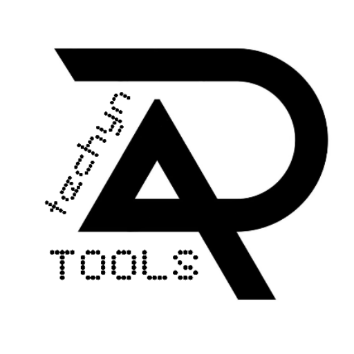

<div align="center">



# ArchiveWeb.page (Fork) by techynAR

A high fidelity browser archival extension for modern web applications, enhanced with experimental **Visual QC Snapshot** capabilities for dynamic websites, annotation platforms and internal QA workflows.

[Website](https://aw-fork.techynar.com) • [Download](https://aw-fork.techynar.com) • [techynAR Tools](https://tools.techynar.com) • [Original ArchiveWeb.page](https://archiveweb.page)

</div>

---

## About

**ArchiveWeb.page (Fork) by techynAR** is an open source fork of the excellent **ArchiveWeb.page** project by Webrecorder.

This fork was created to experiment with improved archival of modern, JavaScript-heavy web applications, especially those used for AI annotation, quality assurance, browser testing and internal review workflows.

The project retains full compatibility with the WACZ ecosystem while introducing new experimental capabilities focused on preserving the visual state of complex applications.

This repository exists primarily as an engineering project and internal utility, but is available publicly for anyone interested in contributing or building upon it.

---

# Why this fork?

Modern web applications are no longer simple HTML pages.

Annotation tools, React applications, canvas editors, SVG based interfaces and AI labeling platforms generate a large amount of client-side state that traditional web archives often cannot preserve accurately.

This fork explores ways of archiving these applications with higher visual fidelity while remaining compatible with the existing ArchiveWeb.page ecosystem.

Current areas of experimentation include:

- Visual QC Snapshot
- DOM State Preservation
- Canvas Preservation
- SVG Preservation
- Form State Preservation
- Better support for dynamic SPAs
- Improved QA workflows
- Experimental no-reload capture

---

# Features

- High fidelity webpage archiving
- Interactive browser recording
- Portable WACZ archive generation
- Replay using ReplayWeb.page
- Local browser storage
- Privacy focused architecture
- Chrome Debugger Protocol based recording

### Experimental Features (Fork)

- Visual QC Snapshot
- DOM state preservation
- Canvas preservation
- SVG preservation
- Form value preservation
- Annotation workflow support
- Dynamic SPA archival improvements

> Experimental features are actively under development and may change over time.

---

# Visual QC Snapshot

One of the primary goals of this fork is introducing an experimental **Visual QC Snapshot** mode.

When enabled, the extension captures the final client-side visual state immediately before recording stops.

The snapshot is intended to preserve information that normally exists only inside the browser after page load, including:

- DOM state
- Filled forms
- Canvas drawings
- SVG overlays
- Annotation interfaces
- Dynamic application state

This feature is especially useful for:

- AI annotation platforms
- Browser QA
- Internal review workflows
- Research documentation
- Dynamic web applications

---

# Architecture

Like the original project, this fork is built on the Chrome Debugging Protocol and the excellent ReplayWeb.page ecosystem.

Core components include:

- ArchiveWeb.page
- ReplayWeb.page
- wabac
- WACZ format
- Chrome DevTools Protocol
- IndexedDB storage

The extension captures browser traffic and stores archives locally before exporting portable WACZ files for replay.

---

# Installation

## Download

Download the latest release from:

https://aw-fork.techynar.com

or build locally from source.

---

## Load the Extension in Chrome

1. Open:

```
chrome://extensions
```

2. Enable **Developer Mode** in the top-right corner.

3. Click **Load unpacked** in the top-left toolbar.

4. Select the extracted `techynar_archiveweb_extension` folder.

5. Pin **ArchiveWeb.page (Fork)** to your toolbar and start archiving.

---

# Development

## Prerequisites

- Node.js
- Yarn Classic (v1)

## Clone

```bash
git clone https://github.com/<your-username>/<repo-name>.git

cd <repo-name>
```

## Install

```bash
yarn install
```

## Development Build

```bash
yarn build-dev
```

---

## Watch Mode

```bash
yarn start-ext
```

Reload the unpacked extension after every build.

---

## Production Build

```bash
yarn build
```

---

## Electron

The Electron application continues to build from the shared codebase.

Run:

```bash
yarn start-electron
```

---

# Project Structure

```
src/
dist/
public/
test/
```

The Chromium extension and Electron application continue to share the majority of the same source code.

---

# Privacy

This extension is designed with a local-first philosophy.

- No analytics
- No telemetry
- No cloud sync
- No user tracking

Archives remain inside your browser unless you explicitly export or share them.

Experimental IPFS sharing remains optional and disabled by default.

---

# Roadmap

Current areas of development include:

- Better dynamic application support
- Visual QC Snapshot improvements
- Improved annotation preservation
- Experimental no-reload capture
- Better replay fidelity
- Additional testing tools

---

# Credits

This project is based on the outstanding work by the Webrecorder team.

Original Project:
https://github.com/webrecorder/archiveweb.page

Replay Engine:
https://github.com/webrecorder/replayweb.page

wabac:
https://github.com/webrecorder/wabac.js

---

# Disclaimer

ArchiveWeb.page (Fork) by techynAR is an independent fork of the original ArchiveWeb.page project.

This repository is **not affiliated with, endorsed by, or maintained by the original ArchiveWeb.page authors or Webrecorder**.

All credit for the original architecture, recording engine and replay ecosystem belongs to their respective authors.

This fork exists to explore additional archival workflows and experimental features while building upon the original open source foundation.

---

# License

This repository continues to follow the license of the upstream ArchiveWeb.page project unless explicitly stated otherwise.

Please refer to the LICENSE file included in this repository.

---

<div align="center">


<br>

Part of **techynAR Tools** · Built by **Aryan Sharma**

[techynar.com](https://techynar.com) • [tools.techynar.com](https://tools.techynar.com)

</div>